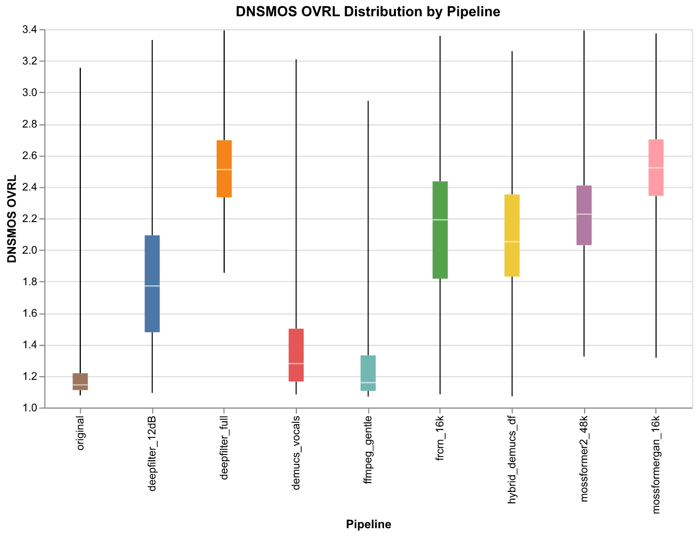
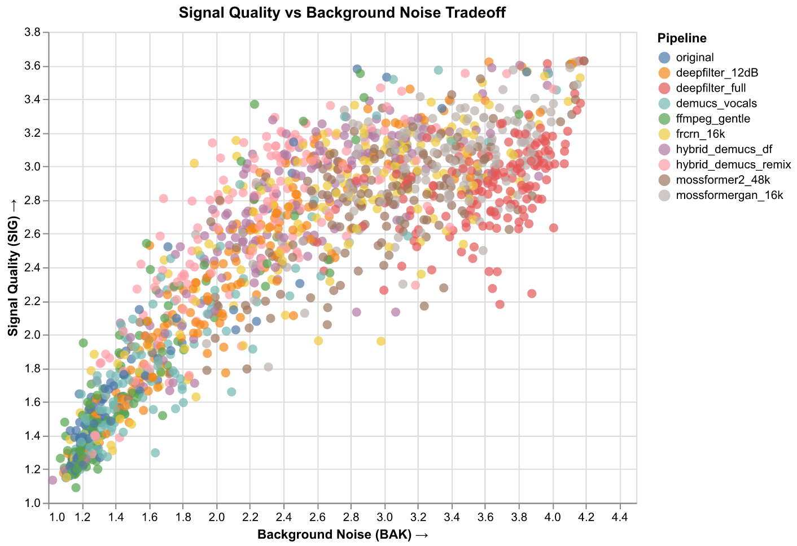
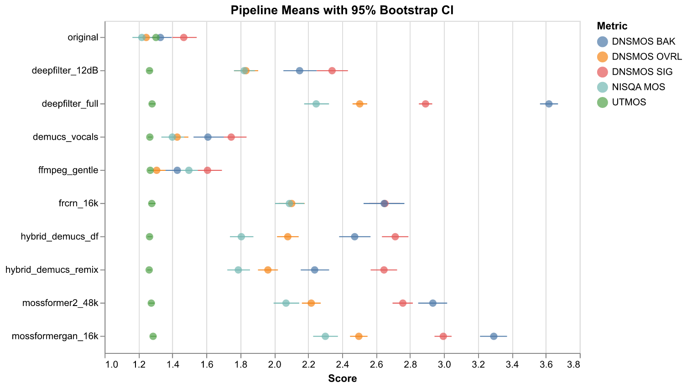

# Reading Room BKK — Audio Enhancement Pipeline

Audio quality enhancement for 429 YouTube recordings (341 hours) from [The Reading Room BKK](https://www.facebook.com/TheReadingRoomBKK/), an independent art and intellectual space in Bangkok (2011–2019).

9 ML and DSP pipelines benchmarked across 40 stratified samples using DNSMOS, NISQA, and UTMOS quality metrics. Goal: improve archival audio while preserving ambient character (laughter, room atmosphere).

## Benchmark Results

### Score Distribution



### Signal vs Background Tradeoff

Aggressive pipelines suppress more noise but can remove ambient atmosphere. The upper-right corner is best — high signal quality with strong background suppression.



### Confidence Intervals

Pipeline means with 95% bootstrap CIs across all metrics.



### Recommended Pipeline

**`hybrid_demucs_df`** — Demucs vocal separation → DeepFilterNet 12dB → ffmpeg loudnorm. Not the highest DNSMOS OVRL, but best subjective quality — preserves ambient atmosphere that gives these archival recordings their documentary value.

| Pipeline | OVRL | SIG | BAK | UTMOS | NISQA |
|----------|------|-----|-----|-------|-------|
| original | 1.19 | 1.39 | 1.25 | 1.28 | 1.23 |
| **hybrid_demucs_df** | **2.13** | **2.78** | **2.54** | **1.25** | **1.82** |
| deepfilter_full | 2.55 | 2.91 | 3.71 | 1.26 | 2.18 |
| mossformergan_16k | 2.53 | 3.02 | 3.39 | 1.27 | 2.24 |

> Full benchmark with 9 pipelines, statistical tests, and audio samples:
> **[Benchmark Report](https://phoneee.github.io/readingroom-audio/benchmark-report/)** ·
> **[Audio Preview](https://phoneee.github.io/readingroom-audio/audio-preview/)** (12 segments × 9 pipelines with seekbar)

## Quick Start

```bash
# Prerequisites: Python 3.12+, uv, ffmpeg
uv sync --extra all

# Run benchmark (40 samples × 9 pipelines, ~3 hours)
python -m readingroom_audio.benchmark run-all

# Quick test (5 samples, 3 pipelines)
python -m readingroom_audio.benchmark run-all --target-n 5 \
    --pipelines original ffmpeg_gentle hybrid_demucs_df

# Batch process all 429 videos with preferred pipeline
python -m readingroom_audio.batch run --pipeline hybrid_demucs_df --resume

# Generate GitHub Pages reports
python -m readingroom_audio.benchmark export
python -m readingroom_audio.benchmark preview
```

See `python -m readingroom_audio --help` for all commands.

## Project Structure

```
readingroom-audio/
├── src/readingroom_audio/
│   ├── enhance.py          # 21 enhancement pipelines
│   ├── score.py            # DNSMOS/NISQA/UTMOS scoring
│   ├── benchmark.py        # Benchmark runner + analysis + export
│   ├── batch.py            # Batch processor for 429 videos
│   ├── mux.py              # Video mux (enhanced audio → MP4)
│   ├── compare.py          # Interactive pipeline comparison
│   ├── listening_test.py   # Listening test generator
│   ├── download.py         # yt-dlp batch download
│   ├── sampling.py         # Stratified sample selection
│   ├── segment.py          # Silero VAD segment extraction
│   └── utils.py            # ffmpeg wrappers, shared helpers
├── data/events/            # 161 event JSONs (committed)
├── docs/                   # GitHub Pages (benchmark report, audio preview)
└── notebooks/              # Interactive analysis with Altair
```

## Documentation

- **[Audio Pipeline](docs/audio-pipeline.md)** — full pipeline catalog (21 pipelines), pilot results, decision log
- **[Benchmark Report](https://phoneee.github.io/readingroom-audio/benchmark-report/)** — statistical analysis, charts, audio comparison
- **[Audio Preview](https://phoneee.github.io/readingroom-audio/audio-preview/)** — interactive side-by-side listening
