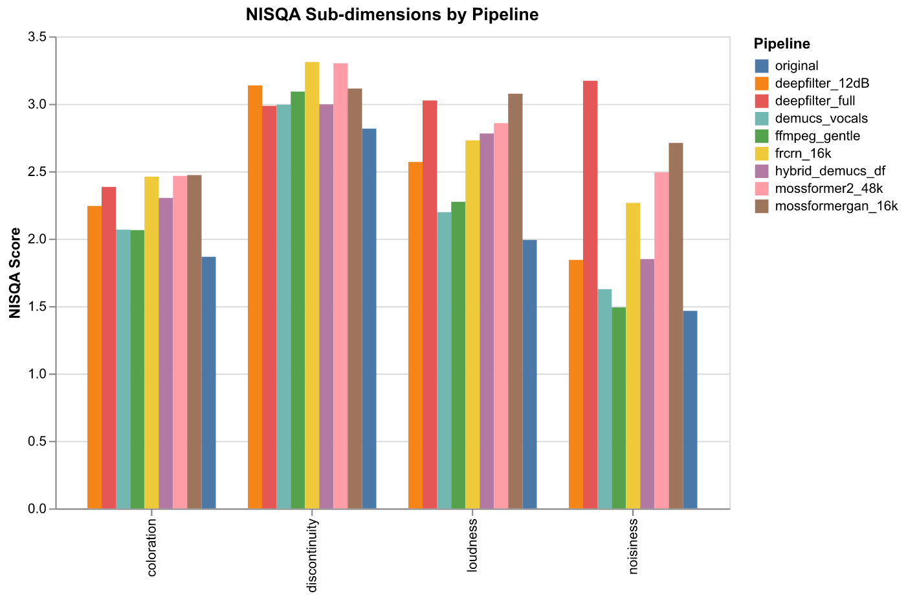
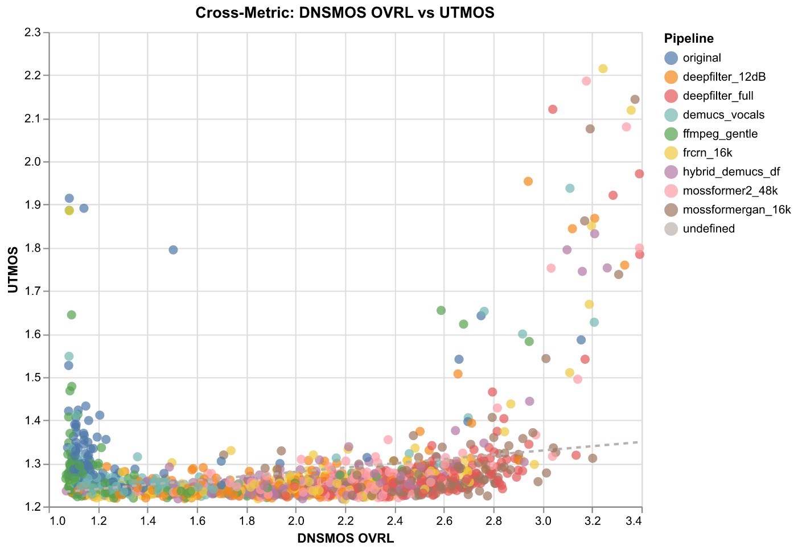
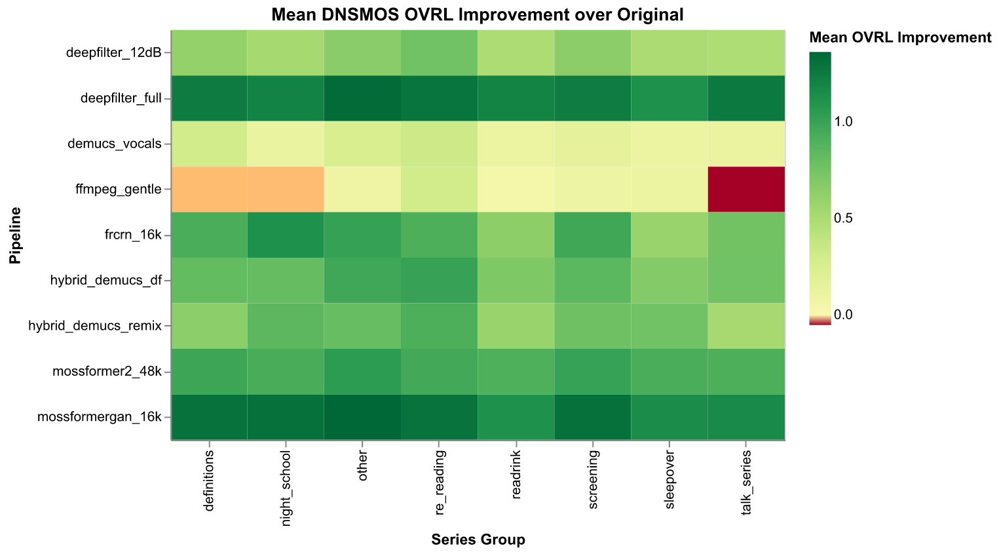

# Audio Enhancement Benchmark Report

## Overview

Benchmark of **9 audio enhancement pipelines** across **all 161 events** (45-second speech-active excerpts selected via Silero VAD) from 429 YouTube recordings of The Reading Room BKK (2011-2019).

Generated: 2026-03-04

## Pipeline Quality Profile

Mean scores across all sub-metrics (higher = better for all except Noise).

| Pipeline | OVRL | SIG | BAK | P.808 | UTMOS | NISQA | Noise | Color | Discont | Loud |
|---|---|---|---|---|---|---|---|---|---|---|
| original | 1.19 | 1.39 | 1.25 | 2.60 | 1.28 | 1.23 | 1.47 | 1.83 | 2.83 | 2.00 |
| deepfilter_12dB | 1.86 | 2.40 | 2.20 | 2.96 | 1.25 | 1.80 | 1.83 | 2.17 | 3.13 | 2.51 |
| deepfilter_full | 2.55 | 2.91 | 3.71 | 3.46 | 1.26 | 2.18 | 3.18 | 2.31 | 2.95 | 2.94 |
| demucs_vocals | 1.41 | 1.75 | 1.60 | 2.78 | 1.25 | 1.43 | 1.65 | 2.04 | 3.01 | 2.24 |
| ffmpeg_gentle | 1.27 | 1.58 | 1.39 | 2.67 | 1.24 | 1.54 | 1.53 | 2.00 | 3.15 | 2.29 |
| frcrn_16k | 2.15 | 2.70 | 2.75 | 3.02 | 1.26 | 2.05 | 2.29 | 2.36 | 3.30 | 2.71 |
| hybrid_demucs_df | 2.13 | 2.78 | 2.54 | 3.09 | 1.25 | 1.82 | 1.87 | 2.25 | 3.03 | 2.76 |
| mossformer2_48k | 2.24 | 2.75 | 3.04 | 3.14 | 1.26 | 2.05 | 2.49 | 2.39 | 3.29 | 2.84 |
| mossformergan_16k | 2.53 | 3.02 | 3.39 | 3.14 | 1.27 | 2.24 | 2.65 | 2.34 | 3.07 | 3.03 |

_OVRL=Overall, SIG=Signal quality, BAK=Background noise, P.808=ITU-T P.808, NISQA=MOS, Noise=Noisiness, Color=Coloration, Discont=Discontinuity, Loud=Loudness_

## Improvement Over Original

Mean improvement delta (pipeline − original). Positive = better.

| Pipeline | ΔOVRL | ΔSIG | ΔBAK | ΔP.808 | ΔUTMOS | ΔNISQA | ΔNoise | ΔColor | ΔDiscont | ΔLoud |
|---|---|---|---|---|---|---|---|---|---|---|
| deepfilter_12dB | +0.68 | +1.01 | +0.95 | +0.36 | -0.04 | +0.57 | +0.35 | +0.34 | +0.30 | +0.51 |
| deepfilter_full | +1.36 | +1.52 | +2.45 | +0.86 | -0.02 | +0.95 | +1.70 | +0.48 | +0.13 | +0.94 |
| demucs_vocals | +0.23 | +0.36 | +0.35 | +0.18 | -0.04 | +0.21 | +0.18 | +0.22 | +0.19 | +0.24 |
| ffmpeg_gentle | +0.09 | +0.19 | +0.13 | +0.08 | -0.04 | +0.31 | +0.06 | +0.18 | +0.32 | +0.29 |
| frcrn_16k | +0.96 | +1.30 | +1.48 | +0.43 | -0.02 | +0.81 | +0.81 | +0.54 | +0.43 | +0.69 |
| hybrid_demucs_df | +0.94 | +1.39 | +1.29 | +0.49 | -0.03 | +0.60 | +0.40 | +0.42 | +0.23 | +0.78 |
| mossformer2_48k | +1.04 | +1.35 | +1.76 | +0.55 | -0.03 | +0.81 | +1.00 | +0.57 | +0.41 | +0.83 |
| mossformergan_16k | +1.33 | +1.62 | +2.12 | +0.55 | -0.01 | +1.00 | +1.17 | +0.52 | +0.20 | +1.01 |

## Score Distribution

Distribution of DNSMOS OVRL scores across all segments for each pipeline.

## Signal vs Background Tradeoff

Each point is one segment. Upper-right corner = best (high signal quality + high background suppression).

## NISQA Sub-dimensions

NISQA decomposes speech quality into noisiness, coloration, discontinuity, and loudness.

## Cross-Metric Correlation

DNSMOS OVRL vs UTMOS — assessing agreement between two independent quality metrics.

## Pipeline Scores by Series Group

Mean DNSMOS OVRL improvement over original, broken down by content series.

## Confidence Intervals

Pipeline means with 95% bootstrap confidence intervals across all metrics.

## Audio Comparison

Representative segments selected for diversity: lowest, median, and highest original DNSMOS OVRL.

### [Seeing the Invisible (Godzilla)](https://www.youtube.com/watch?v=CiPEvCzTxag) (other/early) — Baseline OVRL: 1.09

| Pipeline | OVRL | SIG | BAK | Audio |
|----------|------|-----|-----|-------|
| original | 1.09 | 1.21 | 1.18 | <audio controls src="audio/E034_CiPEvCzTxag/original.mp3"></audio> |
| deepfilter_12dB | 2.39 | 3.13 | 3.09 | <audio controls src="audio/E034_CiPEvCzTxag/deepfilter_12dB.mp3"></audio> |
| deepfilter_full | 2.65 | 2.92 | 3.97 | <audio controls src="audio/E034_CiPEvCzTxag/deepfilter_full.mp3"></audio> |
| demucs_vocals | 1.14 | 1.26 | 1.24 | <audio controls src="audio/E034_CiPEvCzTxag/demucs_vocals.mp3"></audio> |
| ffmpeg_gentle | 1.16 | 1.54 | 1.32 | <audio controls src="audio/E034_CiPEvCzTxag/ffmpeg_gentle.mp3"></audio> |
| frcrn_16k | 2.49 | 2.84 | 3.76 | <audio controls src="audio/E034_CiPEvCzTxag/frcrn_16k.mp3"></audio> |
| hybrid_demucs_df | 2.23 | 2.89 | 2.88 | <audio controls src="audio/E034_CiPEvCzTxag/hybrid_demucs_df.mp3"></audio> |
| mossformer2_48k | 2.43 | 2.74 | 3.80 | <audio controls src="audio/E034_CiPEvCzTxag/mossformer2_48k.mp3"></audio> |
| mossformergan_16k | 2.56 | 2.94 | 3.84 | <audio controls src="audio/E034_CiPEvCzTxag/mossformergan_16k.mp3"></audio> |

### [Right Here, Right Now: Austerity](https://www.youtube.com/watch?v=aV073AHsIZQ) (definitions/late) — Baseline OVRL: 1.14

| Pipeline | OVRL | SIG | BAK | Audio |
|----------|------|-----|-----|-------|
| original | 1.14 | 1.27 | 1.15 | <audio controls src="audio/E127_aV073AHsIZQ/original.mp3"></audio> |
| deepfilter_12dB | 2.14 | 2.76 | 2.45 | <audio controls src="audio/E127_aV073AHsIZQ/deepfilter_12dB.mp3"></audio> |
| deepfilter_full | 2.75 | 3.03 | 3.93 | <audio controls src="audio/E127_aV073AHsIZQ/deepfilter_full.mp3"></audio> |
| demucs_vocals | 1.62 | 2.20 | 1.75 | <audio controls src="audio/E127_aV073AHsIZQ/demucs_vocals.mp3"></audio> |
| ffmpeg_gentle | 1.12 | 1.26 | 1.14 | <audio controls src="audio/E127_aV073AHsIZQ/ffmpeg_gentle.mp3"></audio> |
| frcrn_16k | 2.67 | 3.21 | 3.38 | <audio controls src="audio/E127_aV073AHsIZQ/frcrn_16k.mp3"></audio> |
| hybrid_demucs_df | 2.52 | 3.28 | 2.95 | <audio controls src="audio/E127_aV073AHsIZQ/hybrid_demucs_df.mp3"></audio> |
| mossformer2_48k | 2.62 | 3.09 | 3.52 | <audio controls src="audio/E127_aV073AHsIZQ/mossformer2_48k.mp3"></audio> |
| mossformergan_16k | 2.80 | 3.29 | 3.59 | <audio controls src="audio/E127_aV073AHsIZQ/mossformergan_16k.mp3"></audio> |

### [sign de nuit bangkok](https://www.youtube.com/watch?v=hMVeKeST0dk) (screening/middle) — Baseline OVRL: 1.54

| Pipeline | OVRL | SIG | BAK | Audio |
|----------|------|-----|-----|-------|
| original | 1.54 | 1.95 | 1.80 | <audio controls src="audio/E101_hMVeKeST0dk/original.mp3"></audio> |
| deepfilter_12dB | 2.62 | 3.20 | 3.34 | <audio controls src="audio/E101_hMVeKeST0dk/deepfilter_12dB.mp3"></audio> |
| deepfilter_full | 2.85 | 3.16 | 3.94 | <audio controls src="audio/E101_hMVeKeST0dk/deepfilter_full.mp3"></audio> |
| demucs_vocals | 1.80 | 2.33 | 2.16 | <audio controls src="audio/E101_hMVeKeST0dk/demucs_vocals.mp3"></audio> |
| ffmpeg_gentle | 1.52 | 1.96 | 1.77 | <audio controls src="audio/E101_hMVeKeST0dk/ffmpeg_gentle.mp3"></audio> |
| frcrn_16k | 1.96 | 2.59 | 2.37 | <audio controls src="audio/E101_hMVeKeST0dk/frcrn_16k.mp3"></audio> |
| hybrid_demucs_df | 2.49 | 3.13 | 3.13 | <audio controls src="audio/E101_hMVeKeST0dk/hybrid_demucs_df.mp3"></audio> |
| mossformer2_48k | 2.43 | 2.91 | 3.39 | <audio controls src="audio/E101_hMVeKeST0dk/mossformer2_48k.mp3"></audio> |
| mossformergan_16k | 2.63 | 3.18 | 3.33 | <audio controls src="audio/E101_hMVeKeST0dk/mossformergan_16k.mp3"></audio> |

## Statistical Analysis

### Friedman Test

| Metric | Statistic | p-value | Significant |
|--------|-----------|---------|-------------|
| DNSMOS OVRL | 196.596 | 0.000000 | Yes |
| DNSMOS SIG | 170.969 | 0.000000 | Yes |
| DNSMOS BAK | 207.476 | 0.000000 | Yes |
| UTMOS | 45.662 | 0.000000 | Yes |
| NISQA MOS | 156.492 | 0.000000 | Yes |

### Key Findings

- **Strong agreement** between DNSMOS BAK vs DNSMOS OVRL (rho=0.962)
- **Strong agreement** between DNSMOS BAK vs DNSMOS SIG (rho=0.882)
- **Strong agreement** between DNSMOS OVRL vs DNSMOS SIG (rho=0.952)
- **Strong agreement** between DNSMOS OVRL vs NISQA MOS (rho=0.704)
- **Weak agreement** between DNSMOS BAK vs UTMOS (rho=0.226)
- **Weak agreement** between DNSMOS OVRL vs UTMOS (rho=0.246)
- **Weak agreement** between DNSMOS SIG vs UTMOS (rho=0.181)
- **Weak agreement** between NISQA MOS vs UTMOS (rho=0.050)

## Recommendation

**`hybrid_demucs_df`** (Demucs vocal separation + DeepFilterNet 12dB + loudnorm) is recommended for batch processing. While not the highest-scoring pipeline on DNSMOS OVRL, it provides meaningful improvement over the original while preserving ambient character (laughter, room atmosphere, audience reactions) that gives these archival recordings their documentary value.

More aggressive pipelines (e.g., `deepfilter_full`) score higher on objective metrics but risk over-suppressing the ambient soundscape. The SIG vs BAK tradeoff chart above illustrates this tension.

## Methodology

- **Sampling**: N=161 segments (all events), covering 8 series groups and 3 eras
- **Segment extraction**: 45-second speech-active windows via Silero VAD
- **Metrics**: Non-intrusive quality (DNSMOS P.835, UTMOS, NISQA) — 10 sub-metrics from 3 independent model families
- **Statistics**: Friedman test (omnibus) + Wilcoxon signed-rank (pairwise, Bonferroni corrected) + bootstrap 95% CIs
- **Source**: 429 YouTube recordings (128kbps AAC) from The Reading Room BKK (2011-2019)
- **Metric sufficiency**: Intrusive metrics (PESQ, POLQA) require clean reference audio, unavailable for archival material. Cross-metric agreement analysis confirms DNSMOS and NISQA provide consistent assessments; UTMOS shows saturation on this quality level.
